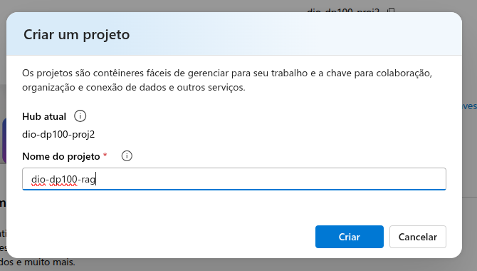
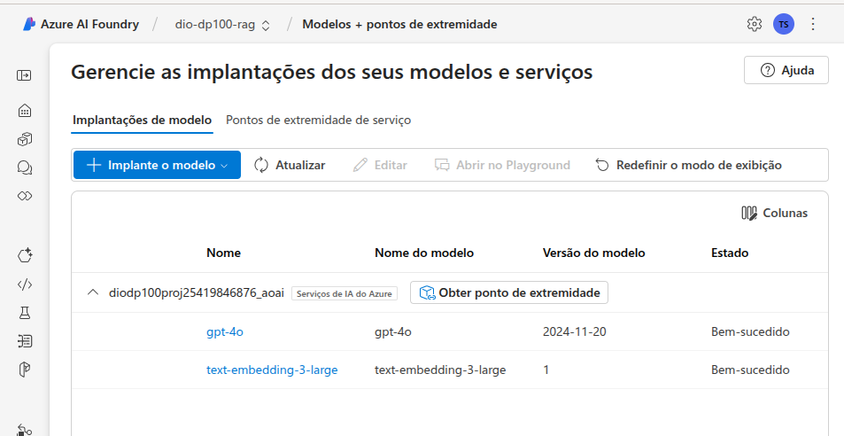

<h1>
    <a href="https://www.dio.me/">
     </a>
    <span>Microsoft Certification Challenge #3 DP-100</span>
</h1>

# :computer: Criando um Chatbot Baseado em Conteúdo de PDFs

Neste desafio, você desenvolverá um chat interativo que responderá com base no conteúdo dos seus arquivos PDF. Para isso, utilizaremos conceitos de IA generativa, embeddings e buscas vetorizadas para estruturar um sistema capaz de entender, processar e responder perguntas a partir de documentos específicos. Essa abordagem permitirá que você crie um modelo personalizado de assistência virtual focado em um conjunto de informações proprietárias, sem depender unicamente do conhecimento geral de modelos pré-treinados.

## Objetivo

O objetivo deste projeto é permitir que você:

✅ Carregue arquivos PDF contendo informações relevantes para seu estudo ou projeto.

✅ Implemente um sistema de busca vetorial para indexar e recuperar informações dos PDFs.

✅ Utilize inteligência artificial para gerar respostas baseadas no conteúdo dos documentos carregados.

✅ Desenvolva um chat interativo onde seja possível realizar perguntas e obter respostas contextuais fundamentadas nos arquivos.

# :bulb: Solução do desafio

Para esse projeto vamos fazer um chat e carregar como dados os arquivos pdf de dissertações de mestrado e teses de doutorado de alguns pesquisadores.

Utilizei como prompt:

```
Você é um assistente de IA especialista em agricultura de precisão na era digital e irá ajudar a responder dúvidas sobre trabalhos realizados de pesquisadores.
```

## Configurando o chat no portal da Azure

### Criando grupo de recursos
<p align='center'>

</p>

### Criando o hub de IA do Azure

<p align='center'>

</p>

### Criando o serviço de pesquisa de IA

<p align='center'>

</p>

### Criando um novo projeto no Azure AI foundry 

<p align='center'>

</p>

### Adicionando os modelos gpt e text embedding

<p align='center'>

</p>

<p align='center'>

</p>

<p align='center'>

</p>

### Carregando arquivos e criando banco de dados vetorial

<p align='center'>

</p>

<p align='center'>

</p>

<p align='center'>

</p>

### Testando o chat com perguntas sobre os PDFs

<p align='center'>

</p>

<p align='center'>

</p>