<h1>
    <a href="https://www.dio.me/">
     </a>
    <span>Microsoft Certification Challenge #3 DP-100</span>
</h1>

# :computer: Treinando Seu Primeiro Modelo de Machine Learning para Prever Vendas

Prevendo Vendas de Cerveja com Machine Learning 🍦📊
Agora é a sua hora de brilhar e construir um projeto incrível para seu portfólio! 🚀 Neste desafio, você aplicará conceitos fundamentais de Machine Learning para prever vendas de cerveja com base na temperatura do dia. Para isso, você criará um modelo preditivo capaz de auxiliar donos de quiosques a otimizarem seus estoques, reduzindo desperdícios e maximizando seus lucros.

Cenário
Imagine que você é proprietário de um quiosque chamada Gelada Mágica, localizada em uma cidade litorânea. Você percebe que a quantidade de cerveja vendida diariamente tem uma forte correlação com a temperatura ambiente. No entanto, sem um planejamento adequado, você pode acabar gelando mais cerveja do que o necessário e ter prejuízos com desperdícios ou, ao contrário, gelar menos e perder vendas.

Para solucionar esse problema, você decide usar Machine Learning para prever quantos litros de cerveja serão vendidos com base na temperatura. Com esse modelo, será possível antecipar a demanda e planejar o estoque de maneira eficiente.


Objetivo
O objetivo deste projeto é desenvolver um modelo de regressão preditiva que permita: 

✅ Treinar um modelo de Machine Learning para prever as vendas de cerveja com base na temperatura do dia.

✅ Registrar e gerenciar o modelo usando o MLflow.

✅ Implementar o modelo para previsões em tempo real em um ambiente de cloud computing.

✅ Criar um pipeline estruturado para treinar e testar o modelo, garantindo reprodutibilidade.

# :bulb: Solução do desafio

## Gerando os dados

Imagine que estamos analisando as vendas de cerveja pelo quiosque Gelada Mágica!

Para gerar os dados de vendas de cerveja utilizei o prompt no Gemini:

```console
Crie uma tabela com 200 linhas de dados de vendas de cerveja com data e temperatura.
```

Podemos ver que os dados gerados possuem data, temperatura e vendas

<p align='center'>
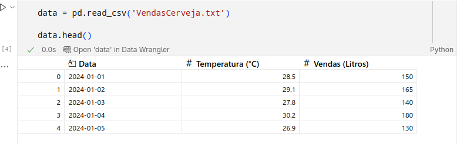
</p>

Plotando os dados de Vendas x Temperatura vemos um comportamento bem linear

<p align='center'>
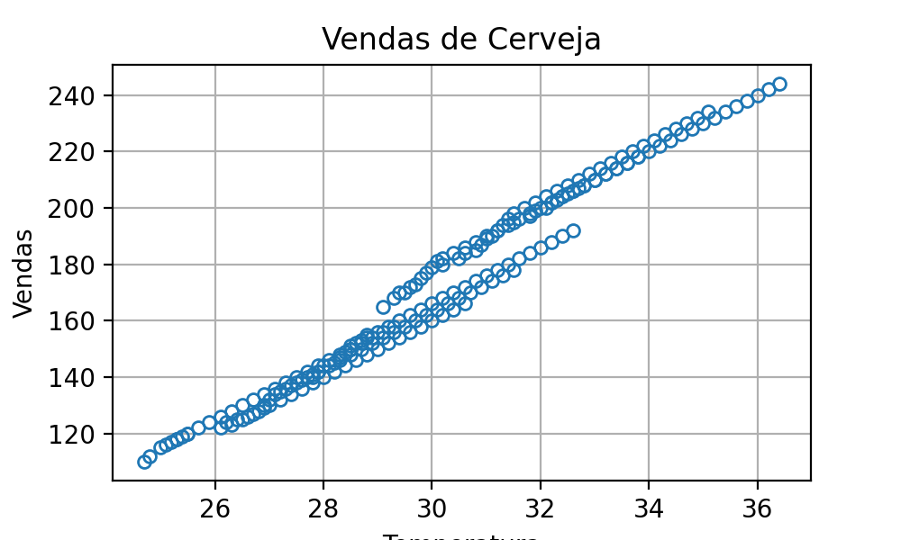
</p>


## Criando o grupo de recursos

<p align='center'>
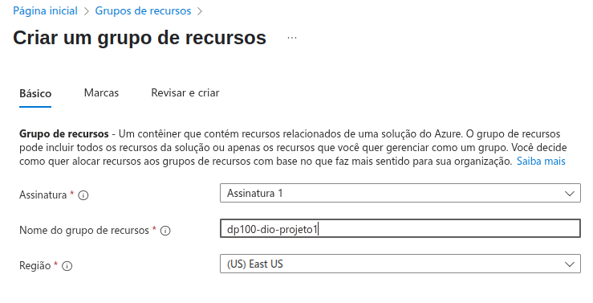
</p>

## Criando recurso Azure Machine Learning

<p align='center'>
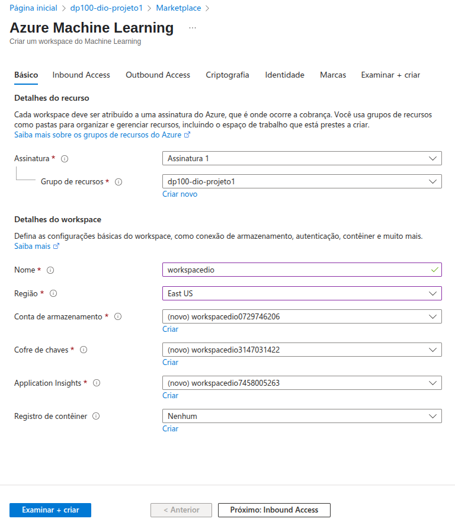
</p>

## Criando instância de computação

<p align='center'>
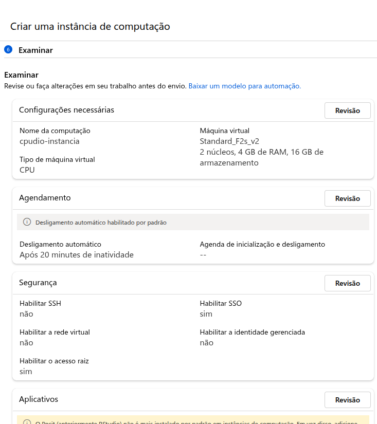
</p>

## Criando cluster de computação

<p align='center'>
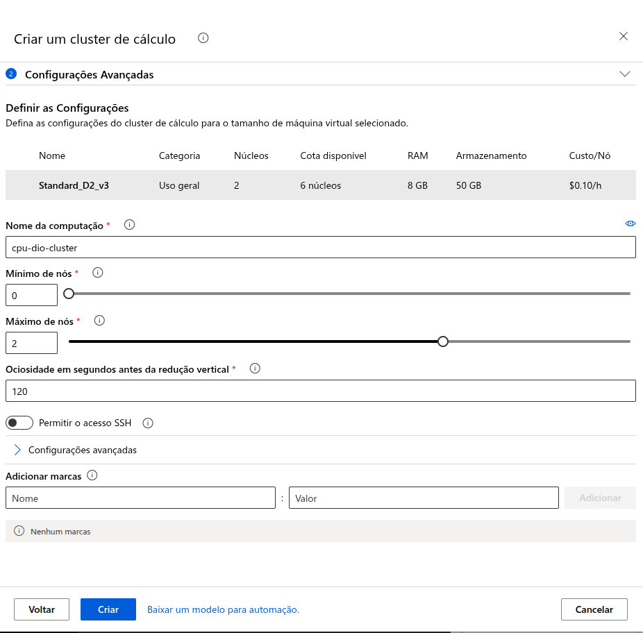
</p>

## Treinamento automático

* Adicionando dados
<p align='center'>
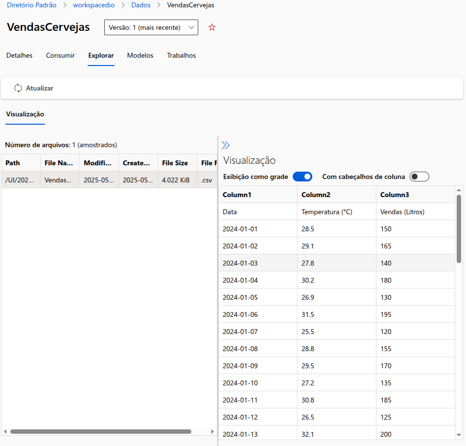
</p>

* Configurando o job

<p align='center'>
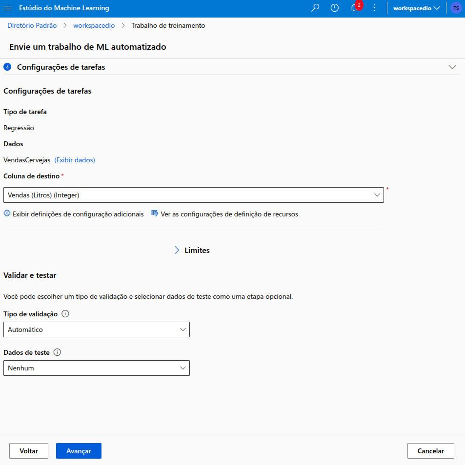
</p>

* Selecioanndo colunas

<p align='center'>
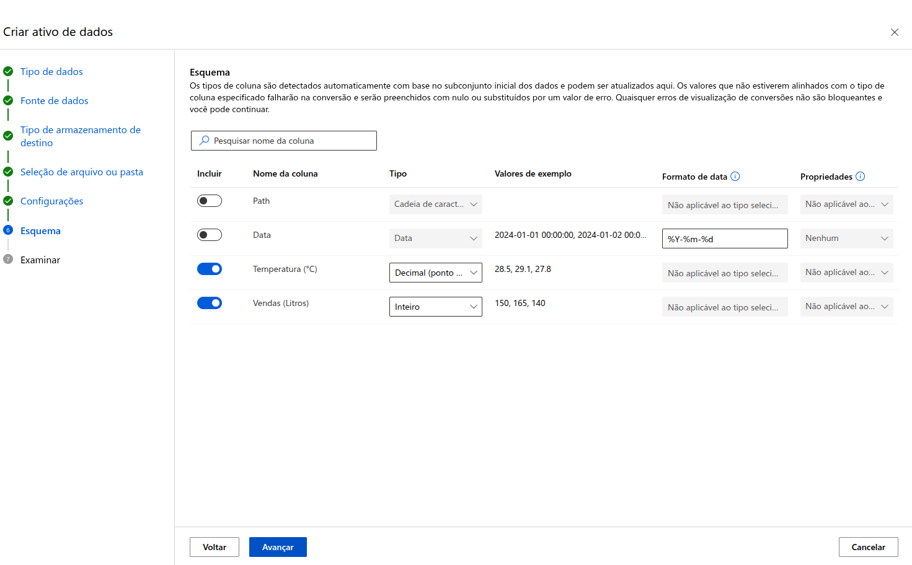
</p>

* Submetendo o job

<p align='center'>
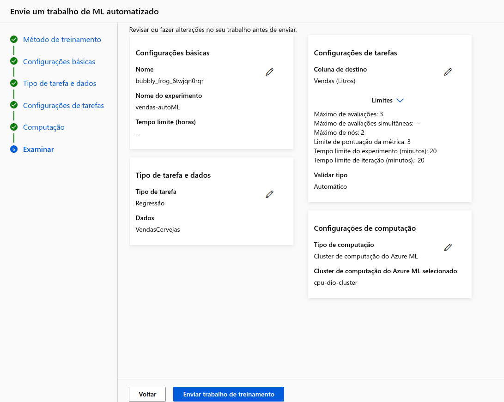
</p>

* Métricas do treinamento

<p align='center'>
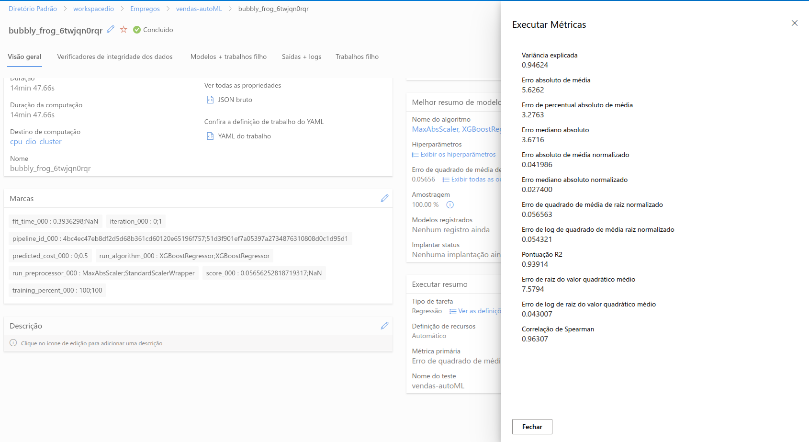
</p>

* Registrando o modelo

<p align='center'>

</p>

* Implementado o modelo

<p align='center'>
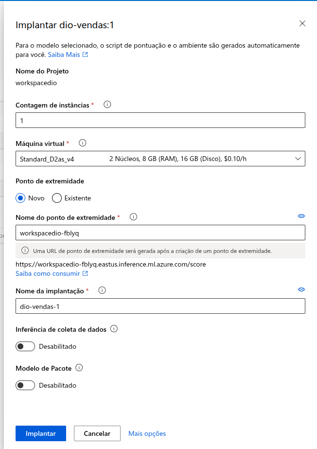
</p>

* Listando o modelo tipo MLFLOW

<p align='center'>
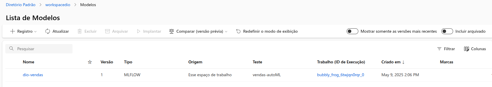
</p>

* Deploy error

<p align='center'>
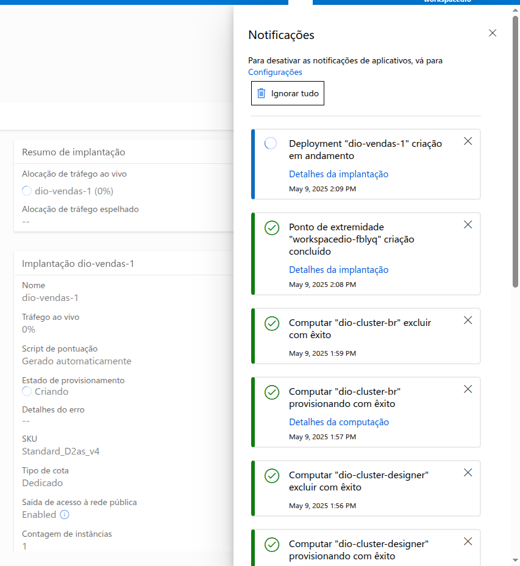
</p>

O deploy ficou em andamento por muito tempo e não tive como testar o endpoint.

## Design

* Criei o design para o pipeline de dados 

<p align='center'>
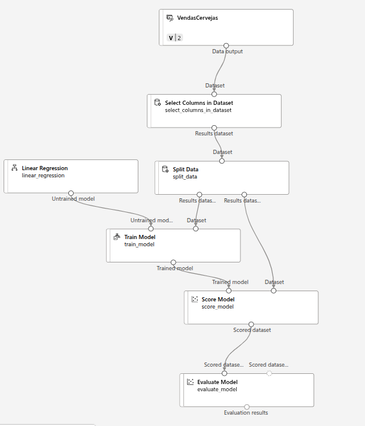
</p>

* Erro para sumissão do pipeline 

<p align='center'>
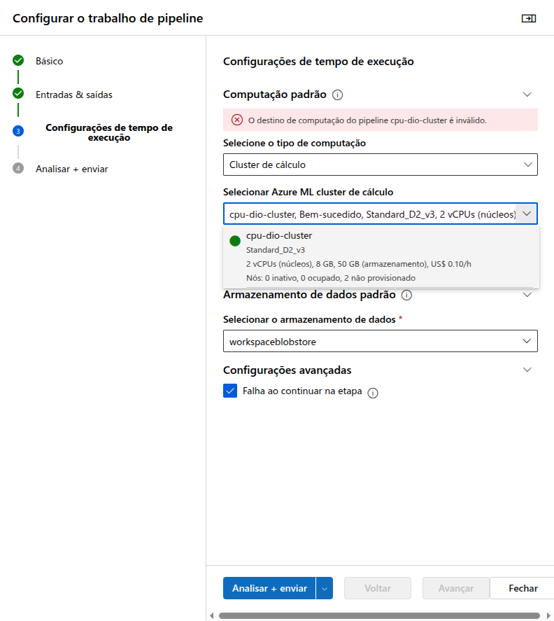
</p>

O Azure retornou como inválido o cluster de computação como destino, mesmo testando diferentes tipos de clusters de computação.

## Treinamento scikit-learn 

* Treinei um modelo de regressão linear com o scikit-learn

<p align='center'>
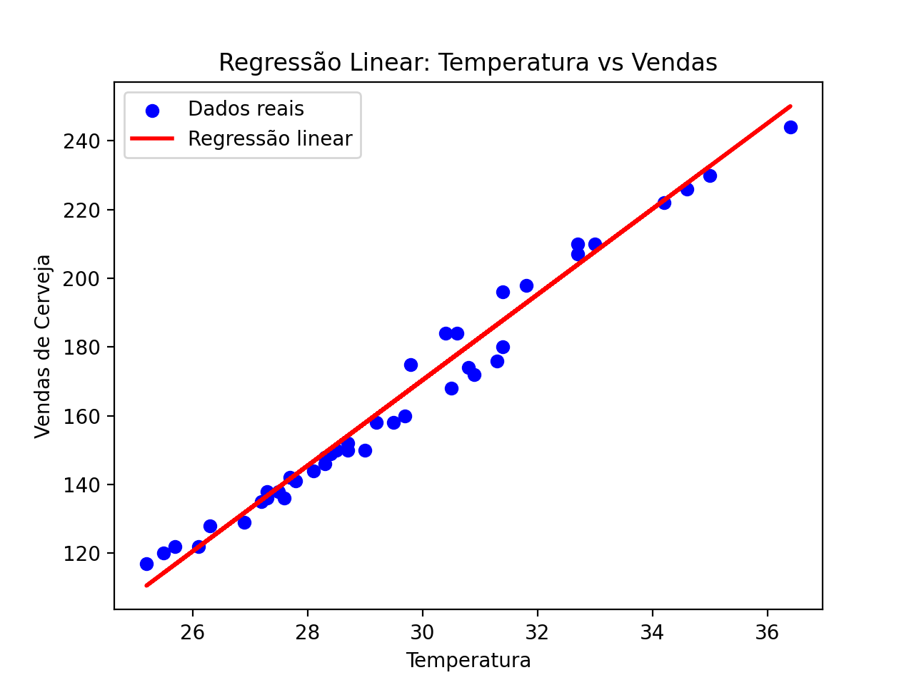
</p>
